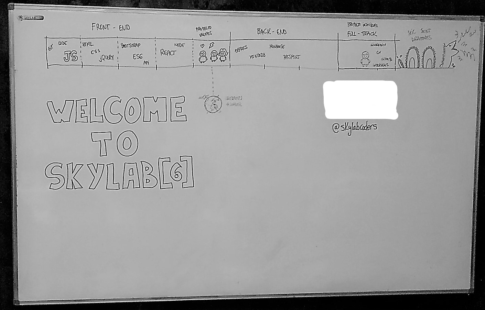

# 
SkyLab Coders - BootCamp
 
## 
Full-Stack Web-Development Bootcamp

#### 
15/01/2018 - 30/03/2018

## Week 1

- [**CLI =>**](course/Conceptos/cli/README.md) *A command-line interface or command language interpreter* 

- [**Agile Web Development =>**](https://www.keycdn.com/blog/agile-web-development/) *broad category of methodologies based on the principles outlined in the Manifesto for Agile Software Development, which was compiled by a team of professional developers in 2001. Specific methods such a scrum and XP are considered agile although they existed before the manifesto was written* 

- [**Markdown =>**](https://markdown.es/) *Markdown’s syntax is intended for one purpose: to be used as a format for writing for the web.*

- [**Git, GitFlow y Github =>**](course/Conceptos/git) *Git is a free and open source distributed version control system*

- [**Jasmine =>**](https://jasmine.github.io/2.9/introduction) *TDD (*Test Driven Development*)*

- [**JavaScript =>**](course/Conceptos/js) *is a high-level, dynamic, weakly typed, prototype-based, multi-paradigm, and interpreted programming language.*

    - **Objects, variables, arrays, functions**
    - **Hositing =>** *Hoisting is JavaScript's default behavior of moving declarations to the top*
    - **Memoization =>** *is a programming technique which attempts to increase a function's performance by caching its previously computed results*
    - **Polyfills =>** *A polyfill is a browser fallback, made in JavaScript, that allows functionality you expect to work in modern browsers to work in older browsers.*
    - **Prototypes =>** *Every JavaScript object has a prototype. The prototype is also an object. All JavaScript objects inherit their properties and methods from their prototype.* 
    - **this & binding =>**  *Usually we apply bind to fix 'this' in an object method, so that we can pass it somewhere.*
    - **High Order Functions =>** *A higher-order function is a function that can take another function as an argument, or that returns a function as a result*
    

### Challenges Week 1

- [this vs binding](https://github.com/AsierDev/skylab-bootcamp/tree/master/course/frontend/topics/javascript/this-vs-binding)   
- [Shuffle Prototype](https://github.com/AsierDev/skylab-bootcamp/tree/master/course/frontend/topics/javascript/shufflePrototype)
- [Prototypes](https://github.com/AsierDev/skylab-bootcamp/tree/master/course/frontend/topics/javascript/prototypes)
- [Objects](https://github.com/AsierDev/skylab-bootcamp/tree/master/course/frontend/topics/javascript/objects-challenge)
- [Control Flow](https://github.com/AsierDev/skylab-bootcamp/tree/master/course/frontend/topics/javascript/ControlFlow)
- [CamelCase Function](https://github.com/AsierDev/skylab-bootcamp/tree/master/course/frontend/topics/javascript/CamelCaseFunction)
- [Box challenge](https://github.com/AsierDev/skylab-bootcamp/tree/master/course/frontend/topics/javascript/challenge-Box)
- [Hangman](https://github.com/AsierDev/skylab-bootcamp/tree/master/course/frontend/topics/javascript/hangman)

## Week 2

- [**HTML5 =>**](course/Conceptos/html) *Hypertext Markup Language is the standard markup language for creating web pages and web applications. With Cascading Style Sheets and JavaScript it forms a triad of cornerstone technologies for the World Wide Web.*

- [**CSS =>**](course/Conceptos/CSS/README.md) *Cascading Style Sheets is a style sheet language used for describing the presentation of a document written in a markup language.*
    - **FlexBox**
    - **Grid**

- [**Sass =>**](https://sass-guidelin.es/es/) *Sass is the most mature, stable, and powerful professional grade CSS extension language in the world.*

- [**DOM =>**](https://developer.mozilla.org/es/docs/DOM) *The Document Object Model is a programming interface for HTML and XML documents. It represents the page so that programs can change the document structure, style, and content. The DOM represents the document as nodes and objects. That way, programming languages can connect to the page. A Web page is a document.*

- [**JQuery =>**](course/Conceptos/$) *jQuery is a fast, small, and feature-rich JavaScript library. It makes things like HTML document traversal and manipulation, event handling, animation, and Ajax much simpler with an easy-to-use API that works across a multitude of browsers.*

- [**Ajax (*Asynchronous JavaScript And XML*) =>**](course/Conceptos/ajax) *a set of Web development techniques using many Web technologies on the client side to create asynchronous Web applications*

- [**Node.js =>**](https://nodejs.org/en/) *Node.js is a platform built on Chrome's JavaScript runtime for easily building fast and scalable network applications.*

### Challenges Week 2

- [Wrap Challenge](https://github.com/AsierDev/skylab-bootcamp/tree/master/course/frontend/topics/javascript/WrapChallenge)
- [Arrays](https://github.com/AsierDev/skylab-bootcamp/tree/master/course/frontend/topics/javascript/arrays)
- [High Order Functions](https://github.com/AsierDev/skylab-bootcamp/tree/master/course/frontend/topics/javascript/higher-order-functions-challenge)

- [Challenges CSS and HTML](https://github.com/AsierDev/skylab-bootcamp/tree/master/course/frontend/topics/HTML-CSS)
- [Challenge Sass](https://github.com/AsierDev/skylab-bootcamp/tree/master/course/frontend/topics/SASS/sassify-this)
- [Task-List jQuery](https://github.com/AsierDev/skylab-bootcamp/tree/master/course/frontend/topics/jQuery/task-list)
- [Mail Chimp Clon LandPage with CSS Grid y FlexBox](https://github.com/AsierDev/skylab-bootcamp/tree/master/course/frontend/topics/HTML-CSS/exercisesCSS/5-landing)

## Week 3

- [**Frameworks =>**](course/Conceptos/frameworks) *Front-end Frameworks (or CSS Frameworks) usually consist of a package made up of a structure of files and folders of standardized code (HTML, CSS, JS documents etc.) which can be used to support the development of websites, as a basis to start building a site.*

    - [**Bootstrap =>**](course/Conceptos/frameworks/bs) *Bootstrap is a free and open-source front-end web framework for designing websites and web applications.*

    - [**Materialize =>**](course/Conceptos/frameworks/materialize) *A modern responsive front-end framework based on Material Design*

    - [**uikit =>**](course/Conceptos/frameworks/uikit) *A lightweight and modular front-end framework for developing fast and powerful web interfaces.*

- [**ECMAScript 6 (ES6)**](course/Conceptos/es6)

    - [**ECMAScript 2015 =>**](course/Conceptos/es6) *ECMAScript 6 is a significant update to the language, and the first update to the language since ES5 was standardized in 2009. ES6 includes many new features*

    - [**ES6 Promises =>**](course/Conceptos/es6/promises) *The Promise object represents the eventual completion (or failure) of an asynchronous operation, and its resulting value.*

    - [**Fetch =>**](course/Conceptos/ajax/fetch)*The Fetch API provides a JavaScript interface for accessing and manipulating parts of the HTTP pipeline, such as requests and responses. It also provides a global fetch() method that provides an easy, logical way to fetch resources asynchronously across the network.*

- [**API =>**](https://medium.freecodecamp.org/what-is-an-api-in-english-please-b880a3214a82) *acronym for Application Programming Interface, which is a software intermediary that allows two applications to talk to each other*    
    

### Challenges Week 3

- **Challenges recursion** 
    - [Digit counter](https://github.com/AsierDev/skylab-bootcamp/tree/master/course/frontend/topics/javascript/CHALLENE-digit-counter) 
    - [Remove Repeated Letters](https://github.com/AsierDev/skylab-bootcamp/tree/master/course/frontend/topics/javascript/CHALLENGE-remove-repeat-chars)
    - [Reverse String](https://github.com/AsierDev/skylab-bootcamp/tree/master/course/frontend/topics/javascript/CHALLENGE-reverse-string)

- [Hangman jQuery](https://github.com/AsierDev/skylab-bootcamp/tree/master/course/frontend/topics/jQuery/Hangman%20JQuery)
- [Hangman JS6](https://github.com/AsierDev/skylab-bootcamp/tree/master/course/frontend/topics/ECMA2015/hangman-ECMA2015)
-[API BeerApp](https://github.com/AsierDev/skylab-bootcamp/tree/master/course/frontend/topics/jQuery/beerApp-Ajax)
- [Challenge Photo App clone](https://github.com/AsierDev/skylab-bootcamp/tree/master/course/frontend/topics/bootstrap/CHALLENGE-photo-app-bs)
- [API Spotify client](https://github.com/AsierDev/skylab-bootcamp/tree/master/course/frontend/topics/bootstrap/spotify)   
